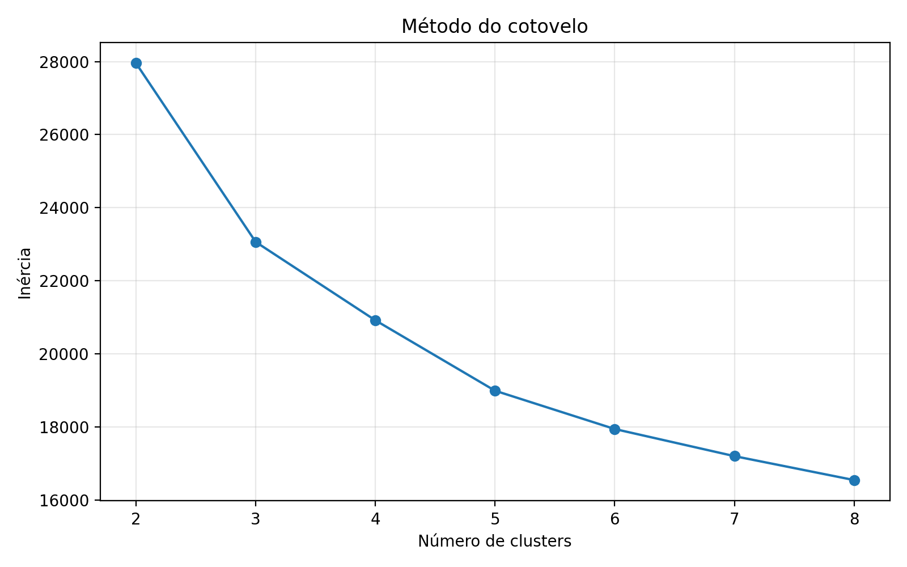
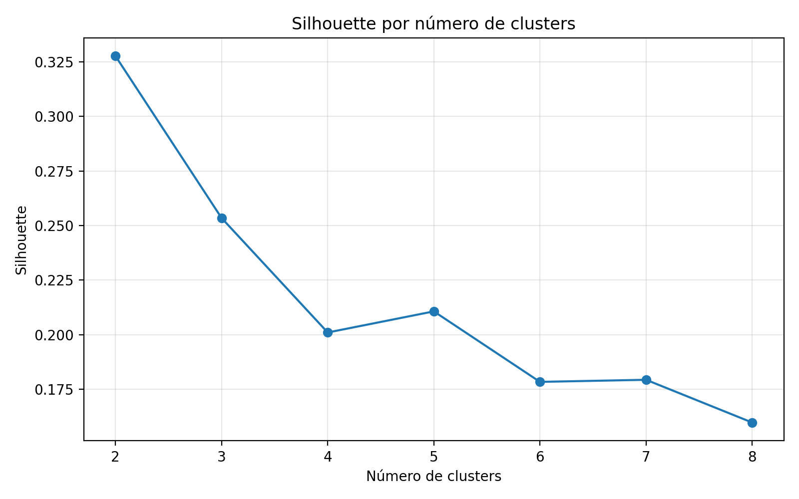
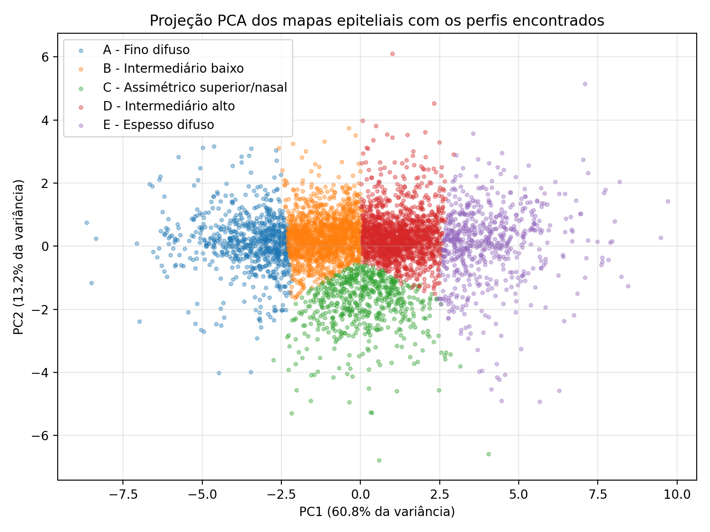
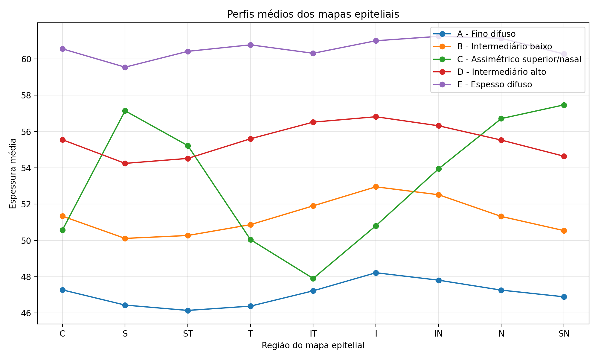
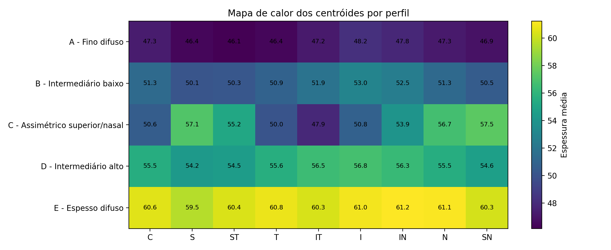

# Perfis de Espessura em Mapas Epiteliais

## Resumo

A análise identificou cinco perfis principais de mapas epiteliais. A maior parte dos exames se organiza por um eixo de espessura global, indo de mapas mais finos até mapas mais espessos. O principal achado foi um grupo menor, correspondente a 11,93% da base analisada, com padrão regional diferente: maior espessura nas regiões superior e nasal e menor espessura nas regiões temporais. Esse perfil não deve ser interpretado isoladamente como diagnóstico, mas merece investigação complementar por apresentar um comportamento distinto dos demais.

## Introdução

O mapa epitelial permite observar como a espessura do epitélio corneano se distribui nas diferentes regiões do olho. Quando esse tipo de exame é analisado em grande volume, torna-se possível perceber padrões que se repetem entre os pacientes, o que ajuda a organizar a base e a destacar comportamentos que merecem maior atenção.

Este trabalho teve como objetivo identificar perfis recorrentes nos mapas epiteliais da base `RTVue_20221110_MLClass.xlsx`. Para isso, foram consideradas apenas as nove medidas de espessura do exame — `C`, `S`, `ST`, `T`, `IT`, `I`, `IN`, `N` e `SN`. As informações de idade, sexo e olho avaliado foram preservadas apenas para descrever melhor os grupos encontrados.

Como referência clínica geral, estudos de mapeamento epitelial descrevem espessura epitelial central média em torno de 53 a 54 micra em olhos saudáveis. Essa referência ajuda a interpretar os perfis encontrados, distinguindo grupos abaixo dessa faixa, próximos dela ou acima dela (Reinstein et al., 2010; Rocha et al., 2016).

## Como a análise foi feita

A base original continha 5.972 registros. Antes da análise, foi feita uma etapa de conferência para separar exames completos de registros com limitação técnica evidente. Permaneceram apenas os exames com preenchimento nas nove regiões epiteliais e com valores dentro de uma faixa operacional de 30 a 90 micra em todas as medidas.

Dos 993 registros excluídos, 685 tinham campos ausentes em pelo menos uma das regiões epiteliais e 308 apresentavam ao menos uma medida fora da faixa adotada. Esses casos devem ser entendidos como registros que não puderam ser comparados com segurança nesta etapa, e não como exames clinicamente descartáveis. Eles merecem revisão própria em uma análise complementar, porque podem incluir tanto falhas de aquisição quanto casos reais fora do padrão usual. Essa cautela é importante porque a literatura mostra que alterações epiteliais podem acompanhar quadros ectásicos e modificar a leitura topográfica, exigindo interpretação em conjunto com o contexto clínico e com outras camadas do exame (Reinstein et al., 2010; Gupta et al., 2020).

Para formar os grupos, foi utilizado o método K-Means com padronização prévia das nove medidas epiteliais. Na prática, os exames foram comparados entre si de acordo com a distribuição das espessuras nas nove regiões do mapa. Exames com comportamento semelhante foram reunidos em um mesmo grupo, enquanto exames com distribuição diferente foram separados em grupos distintos.

Foram avaliadas soluções com diferentes números de grupos, de 2 a 8. A separação em 2 grupos apresentou a melhor distinção global, como mostrado pela curva de Silhouette, mas reduzia a base a uma leitura muito simples entre mapas mais finos e mais espessos. A solução com 5 grupos foi mantida porque o gráfico do cotovelo ainda sustentava essa divisão e, principalmente, porque ela permitiu separar um padrão regional próprio, que não aparecia de forma clara nas soluções menores.

A projeção abaixo mostra que a maior parte da variação da base está ligada ao nível geral de espessura, mas também evidencia um grupo com desenho regional próprio.

## Análise dos perfis encontrados

A base foi organizada em cinco perfis principais.

| Perfil | Exames | Participação | Espessura média | Idade média | Sexo feminino | OD | Interpretação do perfil |
| --- | ---: | ---: | ---: | ---: | ---: | ---: | --- |
| A — Fino difuso | 763 | 15,32% | 47,07 micra | 41,91 anos | 62,71% | 51,38% | Perfil globalmente mais fino e homogêneo |
| B — Intermediário baixo | 1.511 | 30,35% | 51,31 micra | 39,27 anos | 56,20% | 52,02% | Faixa intermediária baixa, com discreto predomínio inferior |
| C — Assimétrico superior/nasal | 594 | 11,93% | 53,31 micra | 31,14 anos | 41,25% | 47,98% | Perfil com maior contraste regional, mais espesso em superior/nasal e mais fino em temporal |
| D — Intermediário alto | 1.494 | 30,01% | 55,53 micra | 37,69 anos | 46,85% | 49,87% | Faixa intermediária alta, ainda relativamente homogênea |
| E — Espesso difuso | 617 | 12,39% | 60,59 micra | 40,57 anos | 48,14% | 50,41% | Perfil globalmente mais espesso e homogêneo |

Os gráficos a seguir ajudam a comparar a forma média dos mapas e a intensidade de espessura em cada região.

### Perfil A — Fino difuso

Este perfil reúne os mapas com menor espessura média da base, em torno de 47,07 micra. A distribuição das medidas é uniforme entre as regiões, sem diferenças espaciais marcantes. É, portanto, um padrão globalmente mais fino e homogêneo.

### Perfil B — Intermediário baixo

Este é o grupo mais frequente da base. A espessura média é de 51,31 micra. O comportamento regional permanece regular, com discreta predominância das regiões inferiores. Esse perfil representa uma faixa intermediária de menor espessura e concentra grande parte dos exames com aspecto estável.

### Perfil C — Assimétrico superior/nasal

Este é o achado mais importante da análise. A espessura média global é de 53,31 micra, mas o que realmente diferencia esse grupo é a distribuição regional. As maiores espessuras aparecem em `SN`, `S` e `N`, enquanto as menores estão em `IT` e `T`.

A diferença entre a região mais fina e a mais espessa dentro desse perfil chega a 9,57 micra, muito acima do observado nos demais grupos. Isso mostra que esse conjunto de exames não se destaca apenas por ser mais fino ou mais espesso, mas por apresentar um desenho regional próprio, com reforço superior/nasal e redução temporal.

Esse comportamento merece atenção especial, pois indica a presença de um subconjunto com padrão regional distinto dentro da base.

### Perfil D — Intermediário alto

Este perfil representa uma faixa intermediária mais alta de espessura, com média global de 55,53 micra. A distribuição entre as regiões continua relativamente homogênea, sem alterações espaciais marcantes. Ele funciona como a contraparte mais espessa do Perfil B.

### Perfil E — Espesso difuso

Este perfil concentra os mapas com maior espessura média da base, em torno de 60,59 micra. Assim como o Perfil A, apresenta pouca variação entre as regiões, caracterizando um padrão difuso e homogêneo, porém mais espesso.

## Conclusões

A base analisada pode ser resumida em cinco perfis principais de mapa epitelial. A maior parte dos exames segue um eixo de espessura global, indo de padrões mais finos a padrões mais espessos, com grupos intermediários concentrando a maior parcela dos casos.

O achado de maior relevância foi a identificação de um perfil com assimetria superior/nasal bem marcada. Esse grupo mostra que parte da base não se diferencia apenas pela intensidade geral da espessura, mas também pela forma como essa espessura se distribui no mapa.

Esse resultado cria uma base consistente para aprofundar a análise dos exames, investigar associações com outras informações do paciente e acompanhar se esse padrão regional aparece de forma recorrente em contextos específicos.

Como próximos passos, recomenda-se:

1. Correlacionar os perfis encontrados com variáveis clínicas externas, como diagnóstico, acuidade visual e outros achados do exame.
2. Revisar separadamente os 993 registros excluídos, para entender se predominam falhas técnicas ou casos clinicamente mais complexos.
3. Acompanhar a distribuição desses perfis em novas bases e ao longo do tempo, para avaliar sua utilidade em rotinas de triagem, monitoramento e investigação.

## Referências

- Gupta K, Lalgudi VG, Arora V, Gupta S, Khamar P. *Epithelial remodelling masquerading as keratoconus progression: An interesting case report*. Indian Journal of Ophthalmology. 2020;68(12):3053-3057. doi:10.4103/ijo.IJO_2554_20.
- Reinstein DZ, Gobbe M, Archer TJ, Silverman RH, Coleman DJ. *Epithelial, stromal, and total corneal thickness in keratoconus: three-dimensional display with Artemis very-high frequency digital ultrasound*. Journal of Refractive Surgery. 2010;26(4):259-271. doi:10.3928/1081597X-20100218-01.
- Rocha KM, Perez-Straziota CE, Stulting RD, Randleman JB. *SD-OCT analysis of regional epithelial thickness profiles in keratoconus, postoperative corneal ectasia, and normal eyes*. Journal of Refractive Surgery. 2016;32(3):172-179. doi:10.3928/1081597X-20160121-01.
